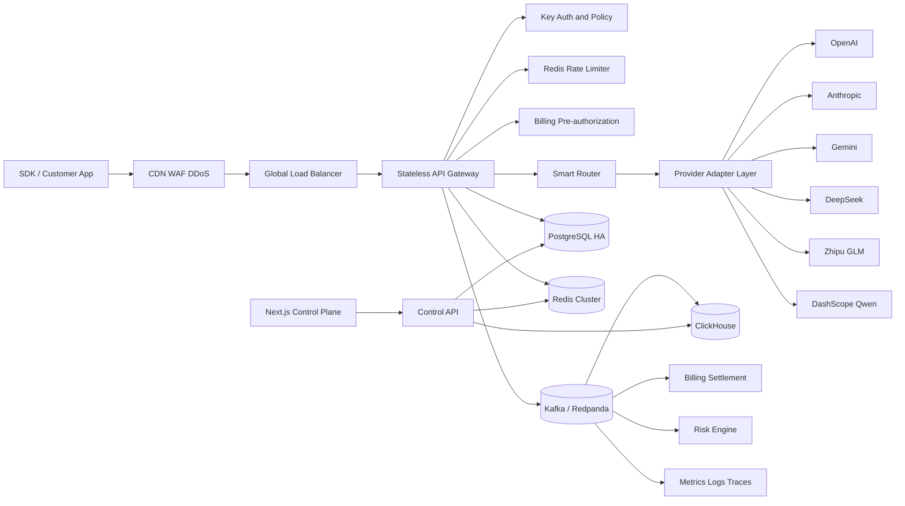

# 北极光 API Relay Platform 企业级架构方案

## 1. 产品定位与边界

北极光是面向个人开发者、团队和企业客户的多模型 API 控制平面与数据平面。平台对外提供 OpenAI 兼容接口，对内统一适配 OpenAI、Anthropic、Google、DeepSeek、智谱和通义千问，并负责鉴权、路由、限流、计费、审计和可观测性。

首期模型范围：

- OpenAI：GPT-4o、GPT-4.1 系列
- Anthropic：Claude 系列
- Google：Gemini 系列
- DeepSeek：Chat、Reasoner 系列
- 智谱：GLM 系列
- 阿里云：通义千问 Qwen 系列

商业目标：提供 API 差价收入、预付套餐收入、企业订阅和私有化部署收入；在保证质量与合规的前提下，将综合毛利率控制在 25% 至 45%。

## 2. 总体架构



### 2.1 技术选型

| 层 | 建议技术 | 说明 |
|---|---|---|
| 数据平面网关 | Go + `net/http`/Chi | 高并发、低内存、SSE 转发稳定，适合 1000+ QPS |
| 控制平面 API | Go 模块化服务或 NestJS | 用户、Key、账单、配置与管理操作 |
| 管理前端 | Next.js App Router + TypeScript | SSR/RSC、RBAC、表格筛选和企业控制台 |
| 事务数据库 | PostgreSQL 16+ 高可用 | 用户、Key、请求摘要、资金账本的事实源 |
| 缓存与限流 | Redis Cluster | Key 策略缓存、令牌桶、熔断状态、幂等锁 |
| 事件总线 | Kafka 或 Redpanda | 请求完成、结算、告警、风控解耦 |
| 日志分析 | ClickHouse | 高基数请求日志、聚合分析、低成本留存 |
| 可观测性 | OpenTelemetry + Prometheus + Grafana | 指标、日志、Trace 统一关联 |
| 部署 | Kubernetes，多可用区 | 水平扩容、滚动升级、故障隔离 |

建议先采用“模块化单体控制平面 + 独立网关 + 独立异步消费者”，避免过早拆分微服务。请求量或团队规模上升后，再将 Billing、Risk、Analytics 拆为独立服务。

## 3. 核心请求链路

1. WAF 校验来源、Bot、区域和基础 IP 频率。
2. 网关解析 `Authorization: Bearer <key>`，只查询 Key 前缀和 HMAC 哈希，不保存明文 Key。
3. Redis Lua 脚本原子执行 Key、用户、IP 三层令牌桶和每日配额检查。
4. 请求标准化为内部 `CanonicalChatRequest`，校验上下文长度、工具调用和输出上限。
5. Billing 根据输入 token、`max_tokens`、模型价格和安全系数执行预扣。
6. Router 根据模式、任务、成本、延迟、健康度和配额选择主模型及 fallback 链。
7. Adapter 转换厂商协议、鉴权、错误码、工具调用和流式事件。
8. 成功后按实际 usage 结算，多退少补；失败则释放预扣。
9. 请求摘要同步写 PostgreSQL，请求事件异步进入 Kafka，落 ClickHouse 并触发风控。

## 4. 统一 API 网关

### 4.1 对外接口

```http
POST /v1/chat/completions
Authorization: Bearer bjg_live_xxx
Content-Type: application/json
Idempotency-Key: 8f0c...
X-Route-Mode: AUTO
X-Timeout-Ms: 30000
X-Request-ID: optional-client-id
```

兼容 OpenAI 的核心请求字段：`model`、`messages`、`temperature`、`top_p`、`max_tokens`、`stream`、`tools`、`tool_choice`、`response_format`、`stop`、`user`。

补充接口：

- `GET /v1/models`：返回当前 Key 可用的逻辑模型与能力。
- `GET /v1/requests/{request_id}`：查询请求状态和计费摘要。
- `POST /v1/usage/estimate`：估算 token、预扣金额和可选路由。
- `GET /health/live`、`GET /health/ready`：容器和依赖健康检查。

### 4.2 内部标准模型

```ts
type CanonicalChatRequest = {
  requestId: string;
  userId: string;
  apiKeyId: string;
  routeMode: "CHEAP" | "BALANCED" | "QUALITY" | "AUTO";
  requestedModel?: string;
  messages: CanonicalMessage[];
  tools?: CanonicalTool[];
  stream: boolean;
  maxOutputTokens: number;
  deadlineMs: number;
  metadata: Record<string, string>;
};
```

每个 Provider Adapter 必须实现：

```ts
interface ProviderAdapter {
  supports(request: CanonicalChatRequest): CapabilityResult;
  estimateTokens(request: CanonicalChatRequest): TokenEstimate;
  transformRequest(request: CanonicalChatRequest): ProviderRequest;
  invoke(request: ProviderRequest, signal: AbortSignal): ProviderResponse;
  stream(request: ProviderRequest, signal: AbortSignal): AsyncIterable<CanonicalChunk>;
  normalizeUsage(response: ProviderResponse): Usage;
  normalizeError(error: unknown): CanonicalError;
}
```

### 4.3 Streaming、超时与重试

- 网关采用 SSE，向客户端输出 OpenAI 风格 `data: {...}`，结束时输出 `data: [DONE]`。
- 连接使用背压控制、心跳、客户端断开检测和上游取消，防止僵尸连接继续产生费用。
- 超时分为连接超时、首字节超时、空闲超时和总超时，不能只使用一个全局 timeout。
- 仅在尚未向客户端发送首个业务 chunk 前允许自动切换上游；流已经输出后不得静默重试，以免生成内容重复或语义断裂。
- 对 `429`、部分 `5xx`、连接失败执行指数退避和 jitter；认证失败、参数错误、内容安全拒绝不重试。
- `Idempotency-Key` 防止客户端重试造成重复扣费；状态保存在 Redis，并将最终结果写入 PostgreSQL。

## 5. 智能路由系统

### 5.1 模式与默认策略

| 模式/任务 | 首选 | Fallback 示例 | 优化目标 |
|---|---|---|---|
| CHEAP / cheap | DeepSeek | Qwen -> GLM | 最低单位成本 |
| BALANCED | GPT-4o mini/同级 | DeepSeek -> Gemini | 成本、延迟、质量均衡 |
| QUALITY / reasoning | Claude | GPT-4.1 -> Gemini | 推理和长文本质量 |
| coding | GPT-4o/GPT-4.1 | Claude -> DeepSeek | 代码正确率和工具调用 |
| fast | GLM | Qwen -> Gemini | 首字节速度 |
| AUTO | 动态评分 | 动态候选链 | 综合最优 |

逻辑模型别名应与具体供应商版本解耦，例如 `aurora-auto`、`aurora-cheap`、`aurora-reasoning`。具体版本通过配置中心灰度切换，避免客户代码绑定厂商版本名。

### 5.2 AUTO 评分

```text
score =
  wq * quality_score
  - wc * normalized_cost
  - wl * normalized_p95_ttft
  + wa * availability_score
  + wf * capability_fit
  - wr * recent_error_penalty
```

候选模型必须先通过硬约束：Key 权限、地区、上下文长度、工具调用、JSON 模式、内容类型、用户预算、供应商额度和健康状态。评分权重按租户、路由模式和任务类型版本化。

### 5.3 健康与熔断

- 每个“供应商账号 + 模型 + 区域”是独立 endpoint pool。
- 使用滑动窗口统计成功率、429、5xx、P50/P95 TTFT 和完整时延。
- 熔断状态：CLOSED -> OPEN -> HALF_OPEN；Redis 保存共享状态，本地缓存 1 至 3 秒。
- Fallback 链最多 2 次切换，防止成本放大和尾延迟失控。
- 支持 1% 至 10% shadow traffic，但 shadow 不向客户收费，且必须脱敏。

## 6. 实时计费与资金安全

### 6.1 计价单位

不同模型 token 成本不同，套餐中的 `100k/500k/2M tokens` 定义为“标准 token 额度”，使用模型倍率换算：

```text
charged_credits = input_tokens * input_multiplier
                + output_tokens * output_multiplier
                + fixed_request_fee
```

价格表必须包含生效时间、供应商成本、销售价、币种、输入/输出价格、缓存价格和路由模式，并在每次请求中保存 `pricing_version` 快照。

### 6.2 预扣与结算

1. 本地 tokenizer 估算输入 token。
2. `reserve = estimated_input_cost + max_output_cost + safety_margin`。
3. PostgreSQL 事务或原子账本函数检查余额并创建 `HOLD`；余额不足返回 `402 insufficient_balance`。
4. 请求完成后写入实际 usage，创建 `CAPTURE` 并释放剩余 HOLD。
5. 上游未返回 usage 时使用本地 tokenizer 结算，后台根据供应商账单进行日终对账。
6. 任何充值、预扣、扣款、退款和人工调整都只追加账本，不原地修改历史记录。

余额字段用于快速读取，Billing 账本是审计事实源；两者通过数据库事务保持一致。

### 6.3 套餐

| 套餐 | 售价 | 标准额度 | 建议定位 |
|---|---:|---:|---|
| 体验包 | ¥39 | 100k | 新用户、Demo、低风险模型 |
| 创作包 | ¥199 | 500k | 内容创作和个人开发者 |
| 团队包 | ¥699 | 2M | 多成员、日志和预算管理 |

高成本模型通过倍率消耗更多标准额度。套餐需设置有效期、赠送额度与现金余额分账，退款优先退未消费现金，不退赠送额度。

## 7. API Key 管理

- Key 格式：`bjg_live_<public_prefix>_<secret>`，只展示一次 secret。
- 数据库存储 `key_prefix` 和 `HMAC-SHA256(secret, server_pepper)`；server pepper 由 KMS 管理。
- 权限：允许模型、允许路由模式、工具调用、流式输出、单次最大 token。
- 限额：QPS、burst、日请求数、日 token、日消费、月消费。
- 网络：IPv4/IPv6 CIDR 白名单、国家/地区策略、可选 mTLS。
- 状态：ACTIVE、PAUSED、REVOKED、EXPIRED；支持定时过期与轮换宽限期。
- 风控：新 IP、异常 User-Agent、失败率突增、消费速度异常时降级、暂停或封禁。

## 8. 数据库结构

以下四张表是核心事务表。生产环境应增加 `organizations`、`memberships`、`provider_accounts`、`model_catalog`、`pricing_rules`、`invoices` 和 `risk_events` 等支持表。

```sql
CREATE EXTENSION IF NOT EXISTS pgcrypto;
CREATE EXTENSION IF NOT EXISTS citext;

CREATE TABLE users (
  id uuid PRIMARY KEY DEFAULT gen_random_uuid(),
  organization_id uuid,
  email citext UNIQUE,
  phone varchar(32) UNIQUE,
  password_hash text,
  display_name varchar(120),
  role varchar(24) NOT NULL DEFAULT 'OWNER',
  status varchar(24) NOT NULL DEFAULT 'ACTIVE',
  plan_code varchar(32) NOT NULL DEFAULT 'FREE',
  currency char(3) NOT NULL DEFAULT 'CNY',
  balance_microunits bigint NOT NULL DEFAULT 0 CHECK (balance_microunits >= 0),
  promo_balance_microunits bigint NOT NULL DEFAULT 0 CHECK (promo_balance_microunits >= 0),
  credit_limit_microunits bigint NOT NULL DEFAULT 0,
  max_qps integer NOT NULL DEFAULT 10,
  daily_spend_limit_microunits bigint,
  risk_score numeric(6,3) NOT NULL DEFAULT 0,
  mfa_enabled boolean NOT NULL DEFAULT false,
  email_verified_at timestamptz,
  last_login_at timestamptz,
  suspended_at timestamptz,
  suspension_reason text,
  metadata jsonb NOT NULL DEFAULT '{}',
  created_at timestamptz NOT NULL DEFAULT now(),
  updated_at timestamptz NOT NULL DEFAULT now(),
  deleted_at timestamptz,
  version integer NOT NULL DEFAULT 1
);

CREATE TABLE api_keys (
  id uuid PRIMARY KEY DEFAULT gen_random_uuid(),
  user_id uuid NOT NULL REFERENCES users(id),
  name varchar(120) NOT NULL,
  key_prefix varchar(32) NOT NULL UNIQUE,
  key_hash bytea NOT NULL,
  status varchar(24) NOT NULL DEFAULT 'ACTIVE',
  allowed_models jsonb NOT NULL DEFAULT '["*"]',
  allowed_route_modes text[] NOT NULL DEFAULT ARRAY['CHEAP','BALANCED','QUALITY','AUTO'],
  qps_limit integer NOT NULL DEFAULT 10,
  burst_limit integer NOT NULL DEFAULT 20,
  daily_request_limit bigint,
  daily_token_limit bigint,
  daily_spend_limit_microunits bigint,
  ip_whitelist cidr[] NOT NULL DEFAULT '{}',
  last_used_ip inet,
  last_used_at timestamptz,
  expires_at timestamptz,
  revoked_at timestamptz,
  revoke_reason text,
  metadata jsonb NOT NULL DEFAULT '{}',
  created_at timestamptz NOT NULL DEFAULT now(),
  updated_at timestamptz NOT NULL DEFAULT now(),
  version integer NOT NULL DEFAULT 1
);
CREATE INDEX api_keys_user_status_idx ON api_keys(user_id, status);

CREATE TABLE requests (
  id uuid NOT NULL DEFAULT gen_random_uuid(),
  request_id varchar(64) NOT NULL,
  idempotency_key varchar(128),
  user_id uuid NOT NULL REFERENCES users(id),
  api_key_id uuid NOT NULL REFERENCES api_keys(id),
  route_mode varchar(16) NOT NULL,
  requested_model varchar(80),
  selected_provider varchar(40) NOT NULL,
  selected_model varchar(80) NOT NULL,
  fallback_chain jsonb NOT NULL DEFAULT '[]',
  streaming boolean NOT NULL DEFAULT false,
  input_tokens integer NOT NULL DEFAULT 0,
  output_tokens integer NOT NULL DEFAULT 0,
  cached_tokens integer NOT NULL DEFAULT 0,
  provider_cost_microunits bigint NOT NULL DEFAULT 0,
  charged_microunits bigint NOT NULL DEFAULT 0,
  pricing_version varchar(40) NOT NULL,
  ttft_ms integer,
  latency_ms integer,
  status varchar(24) NOT NULL,
  http_status smallint,
  retry_count smallint NOT NULL DEFAULT 0,
  error_code varchar(80),
  error_message text,
  client_ip inet,
  user_agent_hash bytea,
  trace_id varchar(64),
  started_at timestamptz NOT NULL,
  completed_at timestamptz,
  created_at timestamptz NOT NULL DEFAULT now(),
  metadata jsonb NOT NULL DEFAULT '{}',
  PRIMARY KEY (id, created_at),
  UNIQUE (request_id, created_at)
) PARTITION BY RANGE (created_at);
CREATE INDEX requests_user_time_idx ON requests(user_id, created_at DESC);
CREATE INDEX requests_key_time_idx ON requests(api_key_id, created_at DESC);
CREATE INDEX requests_status_time_idx ON requests(status, created_at DESC);

CREATE TABLE billing (
  id uuid PRIMARY KEY DEFAULT gen_random_uuid(),
  user_id uuid NOT NULL REFERENCES users(id),
  request_id varchar(64),
  entry_type varchar(24) NOT NULL,
  direction varchar(8) NOT NULL CHECK (direction IN ('DEBIT','CREDIT')),
  amount_microunits bigint NOT NULL CHECK (amount_microunits > 0),
  currency char(3) NOT NULL DEFAULT 'CNY',
  balance_before_microunits bigint NOT NULL,
  balance_after_microunits bigint NOT NULL,
  provider_cost_microunits bigint,
  pricing_version varchar(40),
  package_code varchar(40),
  external_order_id varchar(128),
  idempotency_key varchar(128) UNIQUE,
  status varchar(24) NOT NULL DEFAULT 'POSTED',
  expires_at timestamptz,
  reversed_entry_id uuid REFERENCES billing(id),
  description text,
  metadata jsonb NOT NULL DEFAULT '{}',
  created_at timestamptz NOT NULL DEFAULT now(),
  posted_at timestamptz,
  created_by uuid
);
CREATE INDEX billing_user_time_idx ON billing(user_id, created_at DESC);
CREATE INDEX billing_request_idx ON billing(request_id) WHERE request_id IS NOT NULL;
CREATE UNIQUE INDEX billing_external_order_idx ON billing(external_order_id)
  WHERE external_order_id IS NOT NULL;
```

`requests` 按月分区，保留 90 至 180 天在线摘要；详细事件进入 ClickHouse，原始敏感 prompt 默认不落盘，企业客户可配置加密留存策略。

## 9. 日志、监控与分析

每个请求必须记录：`request_id`、`trace_id`、`user_id`、`api_key_id`、route mode、model、provider、input/output tokens、provider cost、charged amount、TTFT、latency、status、error、IP 和 timestamp。

核心仪表盘：

- 业务：收入、充值、消费、余额、毛利、ARPU、付费转化、流失。
- 路由：模型分布、fallback 率、重试率、成本节省率、质量反馈。
- 稳定性：QPS、并发流、P50/P95/P99 TTFT、错误率、429、熔断状态。
- 风控：异常 IP、Key 共享、突增消费、被封禁 Key、拒绝金额。

告警建议：

- 网关 5xx > 1% 持续 5 分钟。
- 任一 provider 成功率 < 95% 或 P95 TTFT 超阈值。
- 预扣与结算差额、负余额、账本不平。
- 单 Key 消费速度高于历史均值 5 倍。
- Kafka lag、ClickHouse 写入延迟、PostgreSQL 连接池饱和。

## 10. 企业级安全

- 边缘：DDoS、WAF、Bot 管理、地域规则、TLS 1.2+。
- 身份：短期会话、MFA、RBAC、企业 SSO/SAML、SCIM。
- Key：只存 HMAC、一次展示、可轮换、可过期、前缀可检索。
- Provider 凭据：KMS Envelope Encryption，按环境与租户隔离，定期轮换。
- 限流：Redis Lua 原子令牌桶，Key/User/IP/Organization 多层配额。
- 防盗刷：设备/IP 画像、消费速度、失败率、地理跃迁和调用模式异常检测。
- 自动处置：降速、挑战、暂停 Key、冻结账户、通知管理员；所有处置可审计和人工恢复。
- 隐私：默认不记录 prompt/response；调试留存必须显式开启、加密、设置 TTL 并支持删除。
- 合规：操作审计、账单审计、数据驻留、备份恢复演练、供应商 DPA；面向中国大陆运营时单独评估备案、数据跨境和生成式 AI 相关要求。

## 11. Next.js 管理端信息架构

### Dashboard

- 当前余额、今日消费、请求量、成功率、平均 TTFT、模型分布、毛利趋势。
- 余额不足、Key 风险、供应商异常和额度临期采用明确告警带。

### API Keys

- Key 列表、创建、一次性密钥展示、权限模板、QPS/日限额/IP 白名单、暂停、轮换和撤销。
- 高风险操作需要二次确认和审计原因。

### Logs

- 按 request_id、Key、模型、状态、时间、延迟和成本筛选。
- 详情抽屉展示路由链、重试、tokens、成本、错误和 Trace，不默认展示敏感正文。

### Billing

- 余额、充值套餐、现金/赠送额度、账本、发票、账单导出和自动充值。
- 企业版支持部门预算、成本中心和月结额度。

### Routing

- CHEAP、BALANCED、QUALITY、AUTO 四种模式。
- 展示模式目标、可用模型、fallback 顺序、最近节省成本和延迟，不向普通用户暴露过度复杂的供应商细节。

### Enterprise Security

- 成员、角色、SSO、审计日志、网络策略、告警联系人和数据留存策略。

前端通过 BFF 访问控制平面，不直接访问数据库；所有金额在服务端计算，前端仅展示服务端结果。

## 12. 性能、扩展与容灾

### 12.1 SLO

- 网关可用性：99.95%，企业版 99.99%。
- 平台内部开销：P95 < 50ms，不含模型生成。
- 可用模型首字节：目标 P50 < 800ms；完整响应时延按模型和输出长度单独统计。
- 支持不低于 1000 QPS，流式连接和普通请求分开容量规划。
- 计费准确率 100%，账本每日自动对账。

### 12.2 扩容策略

- Gateway 完全无状态，按 QPS、CPU、活跃 SSE 连接数水平扩容。
- Redis Cluster 分片，限流 Key 使用稳定哈希；本地缓存只保存短 TTL 配置。
- PostgreSQL 主写、多只读副本；请求表分区，分析查询迁移到 ClickHouse。
- Provider 连接池按账号与区域隔离，启用 keep-alive、HTTP/2 和并发上限。
- 多可用区部署；RPO <= 5 分钟、RTO <= 30 分钟。企业版可选跨区域热备。
- Backpressure：Kafka 或供应商异常时，优先保证鉴权、计费和在线请求，降级非关键分析任务。

### 12.3 容量基线

上线前进行三类压测：1000 QPS 非流式短请求、至少 10k 并发 SSE、供应商超时/429/5xx 故障注入。网关应在单 provider 故障时自动转移，且不能出现重复扣费或负余额。

## 13. 商业化与利润优化

### 收入结构

1. API 差价：按模型成本、路由模式和服务等级设置 20% 至 60% 加价。
2. 套餐充值：预付现金改善现金流，未消费额度按会计规则递延确认。
3. 企业订阅：成员、SSO、审计、月结、专属限额、SLA 和私有化部署按月/年收费。
4. 增值服务：专属模型路由、数据驻留、技术支持、白标和定制适配。

### 成本控制

- AUTO 优先选择达到质量门槛后的最低综合成本模型。
- 利用 provider prompt caching、批量折扣、承诺用量折扣和多账号容量池。
- 对高成本模型设置倍率、单请求上限和预算保护。
- 精确跟踪“销售收入 - provider cost - 支付通道费 - 基础设施摊销”的贡献毛利。
- 企业客户可设最低月消费和超额阶梯价，避免低利用率专属资源侵蚀利润。

建议定价保护线：任一套餐在 P90 模型组合下预计毛利低于 25% 时，自动调整模型倍率、路由权重或新购价格，不追溯修改已购额度。

## 14. 上线路线图

### Phase 1：可收费 MVP

- OpenAI 兼容网关、3 个 provider、AUTO/CHEAP/BALANCED、Key、预扣计费、充值、基础日志。
- 单区域多可用区、PostgreSQL HA、Redis、基础告警。

### Phase 2：规模化运营

- 全部 6 个 provider、ClickHouse、Kafka、质量评分、熔断、账单与发票、风险规则。
- Next.js 完整控制台、企业成员和预算。

### Phase 3：企业级

- SSO/SAML、SCIM、审计导出、月结、专属 SLA、私有化部署、跨区域容灾。
- 动态利润优化、模型 A/B、质量反馈闭环。

## 15. 上线验收标准

- OpenAI SDK 不改业务代码即可调用 `/v1/chat/completions`，流式和工具调用可用。
- 任一 provider 故障时，未输出首 chunk 的请求可自动 fallback。
- 并发扣费不产生负余额、重复扣费或账本不平。
- Key 的模型权限、QPS、日限额和 IP 白名单均有自动化测试。
- 1000 QPS 和 10k SSE 压测通过，网关内部 P95 开销 < 50ms。
- 请求、账单、路由和风控事件可通过 request_id/trace_id 完整追踪。
- 控制台具备 Dashboard、API Keys、Logs、Billing、Routing 和 Enterprise Security 页面。
- 完成备份恢复、供应商故障、Redis 故障和消息积压演练。

## 16. 官方兼容参考

- OpenAI Chat API: https://platform.openai.com/docs/api-reference/chat/create
- Anthropic Messages Streaming: https://docs.anthropic.com/en/api/messages-streaming
- Google Gemini OpenAI compatibility: https://ai.google.dev/gemini-api/docs/openai
- DeepSeek API: https://api-docs.deepseek.com/
- 智谱开放平台: https://open.bigmodel.cn/dev/api/normal-model/glm-4
- 阿里云 DashScope OpenAI 兼容: https://help.aliyun.com/zh/model-studio/compatibility-of-openai-with-dashscope
